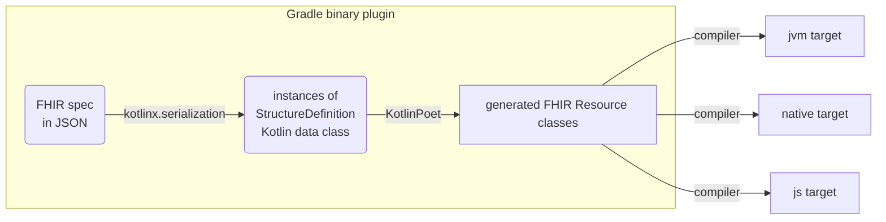

# Kotlin FHIR

[](https://github.com/mkenney/software-guides/blob/master/STABILITY-BADGES.md#alpha) [](https://opensource.org/licenses/Apache-2.0)

Kotlin FHIR is a lean and fast implementation of the
[HL7® FHIR®](https://www.hl7.org/fhir/overview.html) data model on
[Kotlin Multiplatform](https://kotlinlang.org/docs/multiplatform.html).

**Warning:** The library is in alpha and subject to change. Use at your own risk.

## Key features

* Lightweight & fast with a minimal footprint and zero bloat[^1]
* Clean, modern & elegant Kotlin code with minimalistic class definitions
* Code generation[^2] from FHIR specifications for completeness and maintainability
* JSON only[^3], no [XML](https://build.fhir.org/xml.html)
  or [Turtle](https://build.fhir.org/rdf.html) dependencies
* Multiplatform support for Android, iOS and web development, with JVM, native
  code and JavaScript targets
* Support for multiple FHIR versions

[^1]: No dependencies on logging, XML, or networking libraries or any platform-specific
dependencies. Only essential Kotlin Multiplatform dependencies are included, e.g.,
[`kotlinx.serialization`](https://github.com/Kotlin/kotlinx.serialization) and
[`kotlix.datetime`](https://github.com/Kotlin/kotlinx-datetime).

[^2]: Using [KotlinPoet](https://square.github.io/kotlinpoet/).

[^3]: It is also possible to serialize to other formats
[`kotlinx.serialization`](https://github.com/Kotlin/kotlinx.serialization) supports, such as
[protocol buffers](https://protobuf.dev/). However, there is no XML or Turtle support as of
Jan 2025.

## Supported platforms

The library supports the following
[target platforms](https://kotlinlang.org/docs/multiplatform-dsl-reference.html#targets):

| Target platform                    | Target          | Artifact suffix | Support |
|:-----------------------------------|:----------------|:----------------|:--------|
| Kotlin/JVM                         | `jvm`           | `-jvm`          | ✅       |
| Kotlin/Wasm                        | `wasmJs`        | `-wasm-js`      | ✅       |
| Kotlin/Wasm                        | `wasmWasi`      | `-wasm-wasi`    | ✅       |
| Kotlin/JS                          | `js`            | `-js`           | ✅       |
| Android applications and libraries | `androidTarget` | `-android`      | ✅       |

as well as a subset of
[tier 1 Kotlin/Native targets](https://kotlinlang.org/docs/native-target-support.html#tier-1), detailed below:

| Gradle target name | Artifact suffix      | Support |
|:-------------------|:---------------------|:--------|
| macosX64           | `-macosx64`          | ⛔       |
| macosArm64         | `-macosarm64`        | ⛔       |
| iosSimulatorArm64  | `-iossimulatorarm64` | ✅       |
| iosX64             | `-iosx64`            | ✅       |
| iosArm64           | `-iosarm64`          | ✅       |

The library does not support `macos` targets in the tier 1 list, or any
[tier2](https://kotlinlang.org/docs/native-target-support.html#tier-2) and
[tier3](https://kotlinlang.org/docs/native-target-support.html#tier-3) Kotlin/Native targets. This
reflects their limited usage currently rather than technical difficulty. Please contact the team if
you require support for these platforms.

## Data model

### Mapping FHIR primitive data types to Kotlin

In FHIR, primitive data types (e.g. in [R4](https://hl7.org/fhir/R4/datatypes.html)) are defined
using StructureDefinitions[^4]. For instance, the `date` type is defined in
`StructureDefinition-date.json`. While primitive, these types may include an `id` and `extension`s,
preventing direct mapping to Kotlin's primitive types. To resolve this issue, the library generates
a distinct Kotlin class for each FHIR primitive data type, for example, the `Date` class in`Date.kt`
file for the `date` type.

[^4]: A "JSON Definition" link to the StructureDefinition is now included for each FHIR primitive
data type in the [Data Types](https://build.fhir.org/datatypes.html) page in FHIR CI-BUILD.

However, the actual values within these FHIR primitive data types defined using FHIRPath types (e.g.
the `integer.value` element in `StructureDefinition-integer.json` has the FHIRPath type
`System.Integer`) still need to be mapped to Kotlin types in the generated code. The mapping is as
follows:

| FHIRPath type  | Kotlin type  |
|-----------------------------------------------------------------------------|-----------------------------------------------------------------------------|
| System.Boolean                                                              | kotlin.Boolean                                                              |
| System.String                                                               | kotlin.String                                                               |
| System.Integer                                                              | kotlin.Int                                                                  |
| System.Long                                                                 | kotlin.Long                                                                 |
| System.Decimal                                                              | kotlin.Double                                                               |
| System.Date                                                                 | FhirDate                                                                    |
| System.Time                                                                 | kotlinx.datetime.LocalTime                                                  |
| System.DateTime                                                             | FhirDateTime                                                                |

> **Note:**  The `System.Date` and `System.DateTime` types are mapped to sealed interfaces
> `FhirDate` and `FhirDateTime` specifically generated to handle partial dates in FHIR. They are
> implemented using `LocalDate`, `LocalDateTime` and `UtcOffset` classes in the `kotlinx-datetime`
> library.

Since all FHIR data types are defined using FHIRPath types in their StructureDefinitions, mapping
FHIRPath types to Kotlin effectively covers all FHIR data types. For brevity, the full FHIR data
type mapping to Kotlin is omitted here. However, notable exceptions exist where the FHIR data type
uses a FHIRPath type that is either inconsistent with the base data type, or is unsuitable for
represent the data in Kotlin. These exceptions are listed below:

| FHIR data type  | FHIRPath type  | Kotlin type  |
|------------------------------------------------------------------------------|-----------------------------------------------------------------------------|-----------------------------------------------------------------------------|
| positiveInt                                                                  | System.String                                                               | Kotlin.Int                                                                  |
| unsignedInt                                                                  | System.String                                                               | Kotlin.Int                                                                  |

### Mapping FHIR data structure to Kotlin

Similarly, for more complex data structures in FHIR such as complex data types and FHIR resources,
the library maps each StructureDefinition JSON file to a dedicated Kotlin `.kt` file, each
containing a Kotlin class representing the StructureDefinition. BackboneElements in FHIR are
represented as nested classes since they are never reused outside of the StructureDefinition. For
each occurrence of a choice type (e.g. in [R4](https://hl7.org/fhir/R4/formats.html#choice)), a
single sealed interface is generated with a subclass for each type.

| FHIR concept  |                  Kotlin concept                    |
|----------------------------------------------------------------------------|-------------------------------------------------------------------------------------------------------------------|
| StructureDefinition JSON file (e.g. `StructureDefinition-Patient.json`)    | Kotlin .kt file (e.g. `Patient.kt`)                                                                               |
| StructureDefinition (e.g. `Patient`)                                       | Kotlin class (e.g. `class Patient`)                                                                               |
| BackboneElement (e.g. `Patient.contact`)                                   | Nested Kotlin class (e.g. `class Contact` nested under `Patient`)                                                 |
| Choice of data types (e.g. `Patient.deceased[x]`)                          | Sealed interface (e.g. `sealed interface Deceased` nested under `Patient` with subtypes `Boolean` and `DateTime`) |

The generated FHIR resource classes are Kotlin
[data classes](https://kotlinlang.org/docs/data-classes.html). They are compact and readable, with
automatically generated methods: `equals()`/`hashCode()`, `toString()`, `componentN()` functions,
and `copy()`.

The use of sealed interfaces for choice of data types, combined with
Kotlin's [smart casts](https://kotlinlang.org/docs/typecasts.html#smart-casts), eliminates
boilerplate type checks and makes code cleaner, more type-safe, and easier to write. This is
particularly true when used in `when` statements:

```kotlin
when (val multipleBirth = patient.multipleBirth) {
    is Patient.MultipleBirth.Boolean -> {
        // Smart cast to Boolean
        println("Whether patient is part of a multiple birth: ${multipleBirth.value.value}")
    }

    is Patient.MultipleBirth.Integer -> {
        // Smart cast to Integer
        println("Birth order: ${multipleBirth.value.value}")
    }

    null -> {
        // Do nothing
    }
}
```

The generated classes reflect the inheritance hierarchy defined by FHIR. For example, `Patient`
inherits from `DomainResource`, which inherits from `Resource`.

### Mapping FHIR ValueSets to Kotlin Enums

Kotlin enums classes are generated for value sets referenced by elements via [binding](https://hl7.org/fhir/R5/terminologies.html#binding).
The constants in the generated enum classes are derived from the `code` property of the expanded `CodeSystem` concepts in the [expansion packages](https://github.com/google/kotlin-fhir/tree/main/third_party/). The
value sets that are not bound to elements are excluded from code generation.

#### Shared vs. Local Enums

- If the `StructureDefinition` defines an element with a [**common binding**](https://build.fhir.org/ig/HL7/fhir-extensions/StructureDefinition-elementdefinition-isCommonBinding.html), a **shared enum** is generated and placed in the `com.google.fhir.model.<r4|r4b|r5>.terminologies` package.  
  **Example:** `AdministrativeGender`
- If the element uses a **non-common binding**, a **local enum** is created inside the associated parent class.  
  **Example:** `NameUse` inside the `HumanName` class

#### Enum Naming and Content

The enum constants are derived from `ValueSet` definitions in the expansion packages for [R4](https://github.com/google/kotlin-fhir/tree/main/third_party/hl7.fhir.r4.expansions/package), [R4B](https://github.com/google/kotlin-fhir/tree/main/third_party/hl7.fhir.r4b.expansions/package), and [R5](https://github.com/google/kotlin-fhir/tree/main/third_party/hl7.fhir.r5.expansions/package).
Each `ValueSet` includes codes from one or more `CodeSystem` resources it references.

| FHIR concept  | Kotlin concept  |
|----------------------------------------------------------------------------|--------------------------------------------------------------------------------|
| ValueSet JSON file (e.g. `ValueSet-resource-types.json`)                   | Kotlin .kt file (e.g. `ResourceType`)                                          |
| ValueSet (e.g. `ResourceType`)                                             | Kotlin class (e.g. `enum class ResourceType`)                                  |

To comply with Kotlin’s enum naming convention—which requires names to start with a letter and avoid special characters—each code is transformed using a set of formatting rules.
This includes handling numeric codes,special characters, and FHIR URLs. After all transformations, the final name is converted to PascalCase to match Kotlin style guidelines.

| Rule # |                                          Description                                          |                                                           Example Input                                                           |     Example Output     |
|--------|-----------------------------------------------------------------------------------------------|-----------------------------------------------------------------------------------------------------------------------------------|------------------------|
| 1      | For codes that are full URLs, extract and return the last segment after the dot               | `http://hl7.org/fhirpath/System.DateTime` from [CodeSystem-fhirpath-types](http://hl7.org/fhir/R5/codesystem-fhirpath-types.html) | `DateTime`             |
| 2      | Specific special characters are replaced with readable keywords                               | `>=` from   [CodeSystem-quantity-comparator](http://hl7.org/fhir/R5/codesystem-quantity-comparator.html)                          | `GreaterThanOrEqualTo` |
|        |                                                                                               | `>`                                                                                                                               | `GreaterThan`          |
|        |                                                                                               | `<`                                                                                                                               | `LessThan`             |
|        |                                                                                               | `<=`                                                                                                                              | `LessThanOrEqualTo`    |
|        |                                                                                               | `!=` or `<>`                                                                                                                      | `NotEqualTo`           |
|        |                                                                                               | `=`                                                                                                                               | `EqualTo`              |
|        |                                                                                               | `*`                                                                                                                               | `Multiply`             |
|        |                                                                                               | `+`                                                                                                                               | `Plus`                 |
|        |                                                                                               | `-`                                                                                                                               | `Minus`                |
|        |                                                                                               | `/`                                                                                                                               | `Divide`               |
|        |                                                                                               | `%`                                                                                                                               | `Percent`              |
| 3.1    | Replace all non-alphanumeric characters including dashes (`-`) and dots (`.`) with underscore | `4.0.1` from [CodeSystem-FHIR-version](http://hl7.org/fhir/R5/codesystem-FHIR-version.html)                                       | `4_0_1`                |
| 3.2    | Prefix codes starting with a digit with an underscore                                         | `4.0.1` from [CodeSystem-FHIR-version](http://hl7.org/fhir/R5/codesystem-FHIR-version.html)                                       | `_4_0_1`               |
| 3.3    | Apply PascalCase to each segment between underscores while preserving the underscores         | `entered-in-error` from [CodeSystem-document-reference-status](http://hl7.org/fhir/R5/codesystem-document-reference-status.html)  | `Entered_In_Error`     |

### Excluded ValueSets from Enum Generation

The following FHIR value sets are excluded from Kotlin enum generation.

|                                        ValueSet URL                                        |                                           Reason for Exclusion                                            | Affected Version(s) |
|--------------------------------------------------------------------------------------------|-----------------------------------------------------------------------------------------------------------|---------------------|
| [`http://hl7.org/fhir/ValueSet/mimetypes`](http://hl7.org/fhir/ValueSet/mimetypes)         | This value set cannot be expanded because of the way it is defined - it has an infinite number of members | `R4`, `R4B`, `R5`   |
| [`http://hl7.org/fhir/ValueSet/all-languages`](http://hl7.org/fhir/ValueSet/all-languages) | This value set cannot be expanded because of the way it is defined - it has an infinite number of members | `R4`, `R4B`, `R5`   |
| [`http://hl7.org/fhir/ValueSet/use-context`](http://hl7.org/fhir/ValueSet/use-context)     | This value set has >3800 codes when expanded; generated enum class code cannot compile.                   | `R4`, `R4B`, `R5`   |

## Serialization and deserialization

The [Kotlin serialization](https://github.com/Kotlin/kotlinx.serialization) library is used for JSON
serialization/deserialization. All generated classes are marked with annotation `@Serializable`.

A particular challenge in the serialization/deserialization process is that FHIR primitive data
types are represented by two JSON properties (e.g.
in [R4](https://hl7.org/fhir/R4/json.html#primitive)). As a result, the Kotlin data class of any
FHIR resource or element containing primitive data types cannot be directly mapped to JSON.

To address this issue, the library generates
[surrogate](https://github.com/Kotlin/kotlinx.serialization/blob/master/docs/serializers.md#composite-serializer-via-surrogate)
classes (e.g. `PatientSurrogate`) for data classes containing primitive data types, mapping each
primitive data type to two JSON properties (e.g. `gender` and `_gender`) . It also generates custom
serializers (e.g. `PatientSerializer`) that delegate the serialization/deserialization process to the
corresponding surrogate classes and translate between the data classes and surrogate classes.

Serialization and deserialization for **sealed interfaces** follow a similar surrogate-based approach,
with an **additional step to flatten and unflatten JSON**. For polymorphic properties—for example,
`Patient.MultipleBirth`—the library generates a custom serializer (e.g., `PatientMultipleBirthSerializer`)
used in the resource’s surrogate class (e.g., `PatientSurrogate`).

This uses the FhirJsonTransformer (in [R4](https://github.com/google/kotlin-fhir/blob/main/fhir-model/src/commonMain/kotlin/com/google/fhir/model/r4/FhirJsonTransformer.kt), [R4B](https://github.com/google/kotlin-fhir/blob/main/fhir-model/src/commonMain/kotlin/com/google/fhir/model/r4b/FhirJsonTransformer.kt), [R5](https://github.com/google/kotlin-fhir/blob/main/fhir-model/src/commonMain/kotlin/com/google/fhir/model/r5/FhirJsonTransformer.kt)),
to flatten JSON during serialization and restore it during deserialization. This avoids hitting the [JVM constructor argument limit](https://docs.oracle.com/javase/specs/jvms/se19/html/jvms-4.html#jvms-4.3.3) caused by
FHIR fields with many possible types (e.g., [ElementDefinition.pattern](https://www.hl7.org/fhir/R4B/elementdefinition-definitions.html#ElementDefinition.pattern_x_)).
Instead of expanding all types in the surrogate class—which would exceed the limit— polymorphic fields are handled by
custom serializers.

The `toModel` function in each surrogate class merges primitive type values with their extension fields into a single
object, and consolidates related fields for sealed interfaces into their proper model representation.

```mermaid
graph LR
    A["**Patient JSON**
    {
    #nbsp;#nbsp;gender: ...
    #nbsp;#nbsp;_gender: ...
    #nbsp;#nbsp;multipleBirthBoolean: ...
    #nbsp;#nbsp;_multipleBirthBoolean: ...
    #nbsp;#nbsp;multipleBirthInteger: ...
    #nbsp;#nbsp;_multipleBirthInteger: ...
    #nbsp;#nbsp;contact: [
    #nbsp;#nbsp;#nbsp;#nbsp;{
    #nbsp;#nbsp;#nbsp;#nbsp;#nbsp;#nbsp;name: {
    #nbsp;#nbsp;#nbsp;#nbsp;#nbsp;#nbsp;#nbsp;#nbsp;family: ...
    #nbsp;#nbsp;#nbsp;#nbsp;#nbsp;#nbsp;#nbsp;#nbsp;_family: ...
    #nbsp;#nbsp;#nbsp;#nbsp;#nbsp;#nbsp;#nbsp;#nbsp;given: ...
    #nbsp;#nbsp;#nbsp;#nbsp;#nbsp;#nbsp;}
    #nbsp;#nbsp;#nbsp;#nbsp;#nbsp;#nbsp;telecom: [...]
    #nbsp;#nbsp;#nbsp;#nbsp;}
    #nbsp;#nbsp;]
    }
    "]
    B["**Patient JSON (transformed)**
    {
    #nbsp;#nbsp;gender: ...
    #nbsp;#nbsp;_gender: ...
    #nbsp;#nbsp;multipleBirth:{
    #nbsp;#nbsp;#nbsp;#nbsp;multipleBirthBoolean: ...
    #nbsp;#nbsp;#nbsp;#nbsp;_multipleBirthBoolean: ...
    #nbsp;#nbsp;#nbsp;#nbsp;multipleBirthInteger: ...
    #nbsp;#nbsp;#nbsp;#nbsp;_multipleBirthInteger: ...
    #nbsp;#nbsp;}
     #nbsp;#nbsp;contact: [
    #nbsp;#nbsp;#nbsp;#nbsp;{
    #nbsp;#nbsp;#nbsp;#nbsp;#nbsp;#nbsp;name: {
    #nbsp;#nbsp;#nbsp;#nbsp;#nbsp;#nbsp;#nbsp;#nbsp;family: ...
    #nbsp;#nbsp;#nbsp;#nbsp;#nbsp;#nbsp;#nbsp;#nbsp;_family: ...
    #nbsp;#nbsp;#nbsp;#nbsp;#nbsp;#nbsp;#nbsp;#nbsp;given: ...
    #nbsp;#nbsp;#nbsp;#nbsp;#nbsp;#nbsp;}
    #nbsp;#nbsp;#nbsp;#nbsp;#nbsp;#nbsp;telecom: [...]
    #nbsp;#nbsp;#nbsp;#nbsp;}
    #nbsp;#nbsp;]
    }
    "]
    C["**PatientSurrogate object**
    gender
    _gender
    multipleBirth (Sealed Interface)
    contact (MutableList&lt;Patient.Contact&gt;)
    "]
    D["**PatientMultipleBirthSurrogate object**
    multipleBirthBoolean: ...
    _multipleBirthBoolean: ...
    multipleBirthInteger: ...
    _multipleBirthInteger: ...
    "]
    E["**Patient object**
    gender
    multipleBirth
    contact
    "]
    F["**PatientMultipleBirth** sealed interface
    "]
    G["**PatientContactSurrogate object**
    name: HumanName
    telecom: MutableList&lt;ContactPoint&gt;
    "]
    H["**Patient.Contact** backbone element
    "]

    A-->Transformer[FhirJsonTransformer]@{ shape: pill }
    subgraph S1[PatientSerializer]
      Transformer --> B
      B -- deserialize fields --> C
      B -- deserialize sealed interfaces (via surrogate) --> D
      subgraph S2[PatientMultipleBirthSerializer]
        D -- convert to model --> F
      end
      F --> C
      B -- deserialize backbone elements (via surrogate) --> G
      subgraph S3[PatientContactSerializer]
        G -- convert to model --> H
      end
      H --> C
    end
    C -- convert to model --> E

    style A text-align:left
    style B text-align:left
    style C text-align:left
    style D text-align:left
    style E text-align:left
    style F text-align:left
    style G text-align:left
    style H text-align:left
    style S1 stroke-dasharray: 5 5
    style S2 stroke-dasharray: 5 5
    style S3 stroke-dasharray: 5 5
```



> Note: The reverse process can be applied for serialization.

## Implementation

### Overview



The Kotlin FHIR library uses a Gradle binary plugin to automate the generation of Kotlin code
directly
from FHIR specification. This plugin uses [
`kotlinx.serialization`](https://github.com/Kotlin/kotlinx.serialization) library to parse and load
FHIR resource `StructureDefinition`s into an in-memory representation, and then
uses [KotlinPoet](https://square.github.io/kotlinpoet/) to generate corresponding class definitions
for each FHIR resource type. Finally, these generated Kotlin classes are compiled into JVM,
JavaScript and native targets, enabling their use across various platforms.

### Definitions

Kotlin code is generated for StructureDefinitions in the following FHIR packages:

- [hl7.fhir.r4.core](https://simplifier.net/packages/hl7.fhir.r4.core)
- [hl7.fhir.r4b.core](https://simplifier.net/packages/hl7.fhir.r4b.core)
- [hl7.fhir.r5.core](https://simplifier.net/packages/hl7.fhir.r5.core)

> **Note:** The following are **NOT** included in the generated code:
> - [Logical](https://hl7.org/fhir/R4/valueset-structure-definition-kind.html) StructureDefinitions,
>
>> such as [Definition](https://hl7.org/fhir/R4/definition.html),
>> [Request](https://hl7.org/fhir/R4/request.html), and [Event](https://hl7.org/fhir/R4/event.html)
>> in R4
>> - Profiles StructureDefinitions
>> - Constraints (e.g. in [R4](https://hl7.org/fhir/R4/conformance-rules.html#constraints)) and
>> bindings (e.g. in [R4](https://hl7.org/fhir/R4/terminologies.html#binding)) in
>> StructureDefinitions are not represented in the generated code
>> - CapabilityStatements, CodeSystems, ConceptMaps, NamingSystems, OperationDefinitions,
>> SearchParameters, and ValueSets

### FHIR codegen

To put all this together, the
[FHIR codegen](fhir-codegen/gradle-plugin/src/main/kotlin/com/google/fhir/codegen) in the Gradle
binary plugin generates, for each FHIR resource type:

- the model class (the primary class) in the root package e.g. `com.google.fhir.model.r4`,
- the surrogate classes (one for basic primitive type
  mapping to JSON properties, plus extras for each multi-choice/polymorphic property and backbone element)
  in the surrogate package e.g. `com.google.fhir.model.r4.surrogates`, and
- the serializer classes (to delegate serialization/deserialization to the corresponding surrogate classes) in the
  serializer package e.g. `com.google.fhir.model.r4.serializers`,

using
[`ModelTypeSpecGenerator`](fhir-codegen/gradle-plugin/src/main/kotlin/com/google/fhir/codegen/ModelTypeSpecGenerator.kt),
[`SurrogateTypeSpecGenerator`](fhir-codegen/gradle-plugin/src/main/kotlin/com/google/fhir/codegen/SurrogateTypeSpecGenerator.kt),
and
[`SerializerTypeSpecGenerator`](fhir-codegen/gradle-plugin/src/main/kotlin/com/google/fhir/codegen/SerializerTypeSpecGenerator.kt),
respectively.

Additionally,
the [`schema`](fhir-codegen/gradle-plugin/src/main/kotlin/com/google/fhir/codegen/schema) package in
the FHIR codegen contains the schema for structure definitions and helper functions for processing
them, and the
[`primitives`](fhir-codegen/gradle-plugin/src/main/kotlin/com/google/fhir/codegen/primitives)
package contains code to generate special data classes and serializers for primitive data types as
mentioned [earlier](#mapping-fhir-primitive-data-types-to-kotlin).

## User Guide

### Using the Gradle plugin

> **TODO:** add instructions on how to use the gradle plugin once it is published

### Adding the library dependency to your project

To use the Kotlin FHIR model in your project, you need to add the Kotlin FHIR library dependency to
your project. To do that, first make sure to include the [Google Maven](https://maven.google.com/)
repository in the `build.gradle.kts` file in your project root.

```
// build.gradle.kts
repositories {
    // Other repositories such as mavenCentral() and gradlePluginPortal()
    google()
}
```

Next, follow the instructions for your specific project type.

#### Kotlin Multiplatform Projects

For Kotlin Multiplatform projects, add the dependency to the shared `commonMain` source set within
the `kotlin` block of the module's `build.gradle.kts` file (e.g., `composeApp/build.gradle.kts` or
`shared/build.gradle.kts`). This makes the library available across all platforms in your project.

```
// e.g., composeApp/build.gradle.kts or shared/build.gradle.kts
kotlin {
    sourceSets {
        commonMain.dependencies {
            implementation("com.google.fhir:fhir-model:1.0.0-alpha01")
        }
    }
}
```

#### Android projects

For Android projects, add the dependency to the `dependency` block in the module's
`build.gradle.kts` file (e.g., `app/build.gradle.kts`).

```
// e.g., app/build.gradle.kts
dependencies {
    implementation("com.google.fhir:fhir-model:1.0.0-alpha01")
}
```

### Working with FHIR resources

The generated Kotlin classes for FHIR resources are organized in version-specific packages:
`com.google.fhir.<FHIR_VERSION>` where `<FHIR_VERSION>`∈ {`r4`, `r4b`, `r5`}.

For example:

- `com.google.fhir.r4`
- `com.google.fhir.r4b`
- `com.google.fhir.r5`

Within each package, you'll find the corresponding Kotlin classes for all FHIR resources of that
version. For example, the `Patient` class generated for FHIR R4 can be found in the
`com.google.fhir.r4` package.

To create a new instance of a FHIR resource, use the Kotlin class's primary constructor. Since the
primary constructor includes all properties of the class as arguments, **always use
Kotlin's [named arguments](https://kotlinlang.org/docs/functions.html#named-arguments)** for
improved code readability and to avoid errors caused by incorrect parameter order. For example:

```kotlin
import com.google.fhir.model.r4.Address
import com.google.fhir.model.r4.Patient
import com.google.fhir.model.r4.HumanName

fun main() {
    val patient = Patient(
        id = "001",
        name = listOf(
            HumanName(
                given = listOf(com.google.fhir.r4.String(value = "Jing")),
                family = com.google.fhir.r4.String(value = "Tang"),
            ),
        ),
        address = listOf(
            Address(city = com.google.fhir.r4.String(value = "London")),
        ),
        multipleBirth = Patient.MultipleBirth.Boolean(
            com.google.fhir.r4.Boolean(value = false)
        ),
    )
}
```

Alternatively, use Kotlin's `apply` function whilst creating new FHIR resources for additional
flexibility:

```kotlin
import com.google.fhir.model.r4.Address
import com.google.fhir.model.r4.Patient
import com.google.fhir.model.r4.HumanName

fun main() {
    val patient = Patient().apply {
        id = "001"
        name = listOf(
            HumanName().apply {
                given = listOf(com.google.fhir.r4.String(value = "Jing"))
                family = com.google.fhir.r4.String(value = "Tang")
            }
        )
        address = listOf(
            Address().apply {
                city = com.google.fhir.r4.String(value = "London")
            }
        )
        multipleBirth = Patient.MultipleBirth.Boolean(
            com.google.fhir.r4.Boolean(value = false)
        )
    }
}
```

### Serialization and deserialization

To serialize and deserialize FHIR resources, first set up
[kotlinx.serialization](https://github.com/Kotlin/kotlinx.serialization)'s `Json` object with the
extension function `configure<FHIR_VERSION>()` provided by the Kotlin FHIR library for the specific
FHIR version:

```kotlin
import com.google.fhir.model.r4.configureR4  // or com.google.fhir.model.r4b.configureR4b or com.google.fhir.model.r5.configureR5
import kotlinx.serialization.json.Json

fun main() {
    val json = Json {
        configureR4()  // or configureR4b() or configureR5()
    }
}
```

> **Note:** The `Json` object can only be configured to work with a specific FHIR version at a time.
> Use different `Json` objects for working with multiple FHIR versions.

Once the `Json` object is correctly configured, it can be used to serialize and deserialize FHIR
resources of the specific version. In the following example, we first serialize the previously
created patient resource in FHIR R4 to a JSON string, and then deserialize it back into a new
patient object:

```kotlin
import com.google.fhir.model.r4.Patient
import com.google.fhir.model.r4.Resource

fun main() {
    val jsonString = json.encodeToString<Resource>(patient)  // Serialization
    val reconstructedPatient = json.decodeFromString<Resource>(jsonString)  // Deserialization
    
    check(reconstructedPatient is Patient)
}
```

#### Polymorphism

In the example above, notice the type parameter `<Resource>` in the serialization and
deserialization function calls <code>encodeToString<b>\<Resource\></b></code> and
<code>decodeFromString<b>\<Resource\></b></code>. This is a critical detail.

To allow the `kotlinx.serialization` library to determine the resource type at runtime during
_deserialization_, the Kotlin FHIR library uses the `resourceType` JSON property as the
[JSON class discriminator](https://github.com/Kotlin/kotlinx.serialization/blob/master/docs/json.md#class-discriminator-for-polymorphism).
This serves as a hint to the `kotlinx.serialization` library so it can dynamically select the
correct FHIR resource type, or subclass, to instantiate based on the JSON content at runtime.[^5]

[^5]: If the resource type is known at compile time, it is safe to use a more specific type
parameter while deserializing, such as `decodeFromString<Patient>(jsonString)`, provided that the
`Json` object is configured with `ignoreUnknownKeys = true`. The `ignoreUnknownKeys` option is
critical because with the more specific type parameter the `kotlinx.serialization` library knows the
specific type to instantiate and no longer uses the `resourceType` JSON property as a
[JSON class discriminator](https://github.com/Kotlin/kotlinx.serialization/blob/master/docs/json.md#class-discriminator-for-polymorphism)
as is the case when the type parameter `<Resource>` is used. Instead, it will attempt to map the
`resourceType` JSON property to a regular field in the specified class (e.g., `Patient`). As a
result, without `ignoreUnknownKeys = true` an error will occur since the target class does not have
a corresponding field for the `resourceType` property.

However, during _serialization_, it is possible to call the `encodeToString` function without the
type parameter, or with the type parameter of the specific resource type if it is known at compile
time, e.g. `encodeToString<Patient>`. But this would be a mistake, since the `kotlinx.serialization`
library would not treat the serialization as polymorphic in these cases. As a result, it would not
include the `resourceType` property in the serialized result, generating malformed FHIR JSON.
Therefore, when serializing FHIR resources, always make sure to include the `<Resource>` type
parameter like this: <code>encodeToString<b>\<Resource\></b></code>.

```kotlin
import com.google.fhir.model.r4.Resource

fun main() {
    // ✅ DO: 
    val validPatient = json.encodeToString<Resource>(patient)
    
    // ⛔ DON'T:
    // val invalidPatient = json.encodeToString<Patient>(patient)
}
```

> ⚠️ **Warning:** `encodeToString` function must be called with the type parameter `<Resource>`.
> Failing to do so will result in malformed FHIR JSON.

To summarize, we recommend always using the type parameter `<Resource>` when calling
`encodeToString` and `decodeFromString` to serialize and deserialize FHIR resources:
<code>encodeToString<b>\<Resource\></b></code> and <code>decodeFromString<b>\<Resource\></b></code>.
To learn more about polymorphism in serialization in Kotlin, see the
[Kotlin Serialization Guide](https://github.com/Kotlin/kotlinx.serialization/blob/master/docs/polymorphism.md).

## Developer Guide

This section is for developers who want to contribute to the library.

### Running the codegen locally

You can run the codegen locally to generated FHIR models for all supported FHIR versions at once[^6]:

[^6]: To generate FHIR models for specific versions, run `./gradlew <FHIR_VERSION>` where
`<FHIR_VERSION>`∈ {`r4`, `r4b`, `r5`}. The generated code will be located in the
`fhir-model/build/generated/<FHIR_VERSION>` subdirectory.

```bash
./gradlew codegen
```

This will sync all generated code into the `fhir-model/src/commonMain/kotlin` directory and apply
consistent formatting using the [`spotless`](https://github.com/diffplug/spotless) plugin.

> **Note:** The library is designed for use as a dependency. Directly copying generated code into
> your project is generally discouraged as it can lead to maintenance issues and conflicts with
> future updates.

### Testing

The library includes comprehensive **serialization round-trip tests** for examples published in the
following packages:

- [hl7.fhir.r4.examples](https://simplifier.net/packages/hl7.fhir.r4.examples) (5309 examples)
- [hl7.fhir.r4b.examples](https://simplifier.net/packages/hl7.fhir.r4b.examples) (2840 examples)
- [hl7.fhir.r5.examples](https://simplifier.net/packages/hl7.fhir.r5.examples) (2822 examples)

For each JSON example of a FHIR resource in the packages above, a test is performed with the
following steps:

1. Deserialization: The JSON is deserialized into the corresponding generated Kotlin resource class.
2. Serialization: The Kotlin object is then serialized back into JSON format.
3. Verification: The newly generated JSON is compared, character by character[^7], to the original
   JSON to ensure complete fidelity.

[^7]: There are several exceptions. The FHIR specification allows for some variability in data
representation, which may lead to differences between the original and newly serialized JSON. For
example, additional trailing zeros in decimals and times, non-standard JSON property ordering, the
use of `+00:00` instead of `Z` for zero UTC offset, and large numbers represented in standard
notation instead of scientific notation (e.g. 1000000000000000000 instead of 1E18). The
serialization process normalizes these variations, resulting in potentially different JSON output.
However, in all of these cases, semantic equivalence is maintained.

These tests are set up to run on JVM and as Android instrumented tests. To run them locally:

```shell
./gradlew :fhir-model:jvmTest
./gradlew :fhir-model:connectedAndroidTest
```

### Publishing

To create a maven repository from the generated FHIR model, run:

```
./gradlew :fhir-model:publish
```

This will create a maven repository in the `fhir-model/build/repo` directory with artifacts for all
supported platforms.

To zip the repository, run:

```
./gradlew :fhir-model:zipRepo
```

This will generate a `.zip` file in the `fhir-model/build/repoZip` directory.

## Acknowledgements

Thanks to [Yigit Boyar](https://github.com/yigit) for helping bootstrap this project and generously
sharing his expertise in Kotlin Multiplatform and Gradle.
