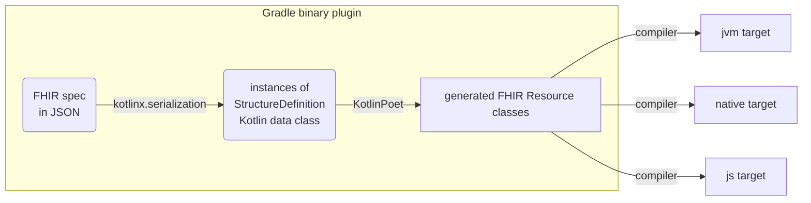
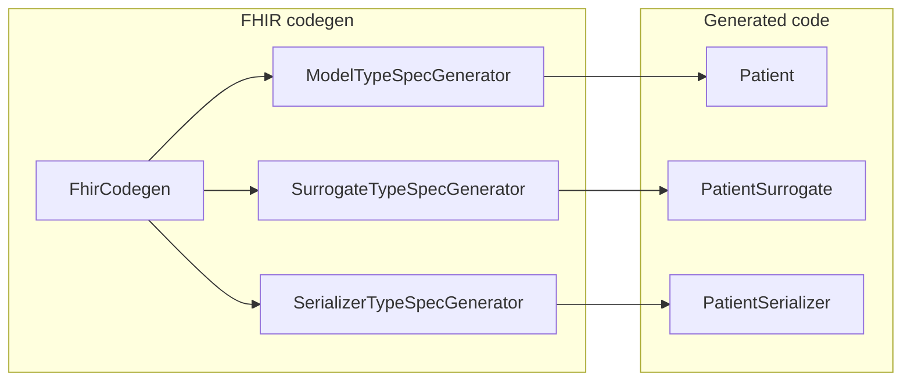

# Kotlin FHIR

[](https://github.com/mkenney/software-guides/blob/master/STABILITY-BADGES.md#alpha) [](https://opensource.org/licenses/Apache-2.0)

Kotlin FHIR is a lean and fast implementation of the
[HL7® FHIR®](https://www.hl7.org/fhir/overview.html) data model on
[Kotlin Multiplatform](https://kotlinlang.org/docs/multiplatform.html).

**Warning:** The library is in alpha and subject to change. Use at your own risk.

## Key features

* Lightweight & fast with a minimal footprint and zero bloat[^1]
* Clean, modern & elegant Kotlin code with minimalistic class definitions
* Code generation[^2] from FHIR specifications for completeness and maintainability
* JSON only[^3], no [XML](https://build.fhir.org/xml.html)
  or [Turtle](https://build.fhir.org/rdf.html) dependencies
* Multiplatform support for Android, iOS and web development, with JVM, native
  code and JavaScript targets
* Support for multiple FHIR versions

[^1]: No dependencies on logging, XML, or networking libraries or any platform-specific
dependencies. Only essential Kotlin Multiplatform dependencies are included, e.g.,
[`kotlinx.serialization`](https://github.com/Kotlin/kotlinx.serialization) and
[`kotlix.datetime`](https://github.com/Kotlin/kotlinx-datetime).

[^2]: Using [KotlinPoet](https://square.github.io/kotlinpoet/).

[^3]: It is also possible to serialize to other formats
[`kotlinx.serialization`](https://github.com/Kotlin/kotlinx.serialization) supports, such as
[protocol buffers](https://protobuf.dev/). However, there is no XML or Turtle support as of
Jan 2025.

## Implementation

### Overview



The Kotlin FHIR library uses a Gradle binary plugin to automate the generation of Kotlin code
directly
from FHIR specification. This plugin uses [
`kotlinx.serialization`](https://github.com/Kotlin/kotlinx.serialization) library to parse and load
FHIR resource `StructureDefinition`s into an in-memory representation, and then
uses [KotlinPoet](https://square.github.io/kotlinpoet/) to generate corresponding class definitions
for each FHIR resource type. Finally, these generated Kotlin classes are compiled into JVM,
JavaScript and native targets, enabling their use across various platforms.

### Definitions

Kotlin code is generated for StructureDefinitions in the following FHIR packages:

- [hl7.fhir.r4.core](https://simplifier.net/packages/hl7.fhir.r4.core)
- [hl7.fhir.r4b.core](https://simplifier.net/packages/hl7.fhir.r4b.core)
- [hl7.fhir.r5.core](https://simplifier.net/packages/hl7.fhir.r5.core)

> **Note:** The following are **NOT** included in the generated code:
>- [Logical](https://hl7.org/fhir/R4/valueset-structure-definition-kind.html) StructureDefinitions,
   such as [Definition](https://hl7.org/fhir/R4/definition.html),
   [Request](https://hl7.org/fhir/R4/request.html), and [Event](https://hl7.org/fhir/R4/event.html)
   in R4
> - Profiles StructureDefinitions
> - Constraints (e.g. in [R4](https://hl7.org/fhir/R4/conformance-rules.html#constraints)) and
    bindings (e.g. in [R4](https://hl7.org/fhir/R4/terminologies.html#binding)) in
    StructureDefinitions are not represented in the generated code
> - CapabilityStatements, CodeSystems, ConceptMaps, NamingSystems, OperationDefinitions,
    SearchParameters, and ValueSets

### Mapping FHIR primitive data types to Kotlin

In FHIR, primitive data types (e.g. in [R4](https://hl7.org/fhir/R4/datatypes.html)) are defined
using StructureDefinitions[^4]. For instance, the `date` type is defined in
`StructureDefinition-date.json`. While primitive, these types may include an `id` and `extension`s,
preventing direct mapping to Kotlin's primitive types. To resolve this issue, the library generates
a distinct Kotlin class for each FHIR primitive data type, for example, the `Date` class in`Date.kt`
file for the `date` type.

[^4]: A "JSON Definition" link to the StructureDefinition is now included for each FHIR primitive
data type in the [Data Types](https://build.fhir.org/datatypes.html) page in FHIR CI-BUILD.

However, the actual values within these FHIR primitive data types defined using FHIRPath types (e.g.
the `integer.value` element in `StructureDefinition-integer.json` has the FHIRPath type
`System.Integer`) still need to be mapped to Kotlin types in the generated code. The mapping is as
follows:

| FHIRPath type  | Kotlin type  |
|-----------------------------------------------------------------------------|-----------------------------------------------------------------------------|
| System.Boolean                                                              | kotlin.Boolean                                                              |
| System.String                                                               | kotlin.String                                                               |
| System.Integer                                                              | kotlin.Int                                                                  |
| System.Decimal                                                              | kotlin.Double                                                               |
| System.Date                                                                 | FhirDate                                                                    |
| System.Time                                                                 | kotlinx.datetime.LocalTime                                                  |
| System.DateTime                                                             | FhirDateTime                                                                |

> **Note:**  The `System.Date` and `System.DateTime` types are mapped to sealed interfaces
> `FhirDate` and `FhirDateTime` specifically generated to handle partial dates in FHIR. They are
> implemented using `LocalDate`, `LocalDateTime` and `UtcOffset` classes in the `kotlinx-datetime`
> library.

Since all FHIR data types are defined using FHIRPath types in their StructureDefinitions, mapping
FHIRPath types to Kotlin effectively covers all FHIR data types. For brevity, the full FHIR data
type mapping to Kotlin is omitted here. However, notable exceptions exist where the FHIR data type
uses a FHIRPath type that is either inconsistent with the base data type, or is unsuitable for
represent the data in Kotlin. These exceptions are listed below:

| FHIR data type  | FHIRPath type  | Kotlin type  |
|------------------------------------------------------------------------------|-----------------------------------------------------------------------------|-----------------------------------------------------------------------------|
| positiveInt                                                                  | System.String                                                               | Kotlin.Int                                                                  |
| unsignedInt                                                                  | System.String                                                               | Kotlin.Int                                                                  |

### Mapping FHIR data structure to Kotlin

Similarly, for more complex data structures in FHIR such as complex data types and FHIR resources,
the library maps each StructureDefinition JSON file to a dedicated Kotlin `.kt` file, each
containing a Kotlin class representing the StructureDefinition. BackboneElements in FHIR are
represented as nested classes since they are never reused outside of the StructureDefinition. For
each occurrence of a choice type (e.g. in [R4](https://hl7.org/fhir/R4/formats.html#choice)), a
single sealed interface is generated with a subclass for each type.

| FHIR concept  | Kotlin concept                                     |
|----------------------------------------------------------------------------|-------------------------------------------------------------------------------------------------------------------|
| StructureDefinition JSON file (e.g. `StructureDefinition-Patient.json`)    | Kotlin .kt file (e.g. `Patient.kt`)                                                                               |
| StructureDefinition (e.g. `Patient`)                                       | Kotlin class (e.g. `class Patient`)                                                                               |
| BackboneElement (e.g. `Patient.contact`)                                   | Nested Kotlin class (e.g. `class Contact` nested under `Patient`)                                                 |
| Choice of data types (e.g. `Patient.deceased[x]`)                          | Sealed interface (e.g. `sealed interface Deceased` nested under `Patient` with subtypes `Boolean` and `DateTime`) |

The generated FHIR resource classes are Kotlin
[data classes](https://kotlinlang.org/docs/data-classes.html). They are compact and readable, with
automatically generated methods: `equals()`/`hashCode()`, `toString()`, `componentN()` functions,
and `copy()`.

The use of sealed interfaces for choice of data types, combined with
Kotlin's [smart casts](https://kotlinlang.org/docs/typecasts.html#smart-casts), eliminates
boilerplate type checks and makes code cleaner, more type-safe, and easier to write. This is
particularly true when used in `when` statements:

```kotlin
when (val multipleBirth = patient.multipleBirth) {
    is Patient.MultipleBirth.Boolean -> {
        // Smart cast to Boolean
        println("Whether patient is part of a multiple birth: ${multipleBirth.value.value}")
    }

    is Patient.MultipleBirth.Integer -> {
        // Smart cast to Integer
        println("Birth order: ${multipleBirth.value.value}")
    }

    null -> {
        // Do nothing
    }
}
```

The generated classes reflect the inheritance hierarchy defined by FHIR. For example, `Patient`
inherits from `DomainResource`, which inherits from `Resource`.

### Mapping FHIR JSON representation to Kotlin

The [Kotlin serialization](https://github.com/Kotlin/kotlinx.serialization) library is used for JSON
serialization/deserialization. All generated classes are marked with annotation `@Serializable`.

A particular challenge in the serialization/deserialization process is that FHIR primitive data
types are represented by two JSON properties (e.g.
in [R4](https://hl7.org/fhir/R4/json.html#primitive)). As a result, the Kotlin data class of any
FHIR resource or element containing primitive data types cannot be directly mapped to JSON.

To address this issue, the library generates
[surrogate](https://github.com/Kotlin/kotlinx.serialization/blob/master/docs/serializers.md#composite-serializer-via-surrogate)
classes (e.g. `PatientSurrogate`) for data classes containing primitive data types, mapping each
primitive data type to two JSON properties . It also generates custom serializers (e.g.
`PatientSerializer`) that delegate the serialization/deserialization process to the corresponding
surrogate classes and translate between the data classes and surrogate classes.

### FHIR codegen



To put all this together, the
[FHIR codegen](fhir-codegen/gradle-plugin/src/main/kotlin/com/google/fhir/codegen) in the Gradle
binary plugin generates three classes for each FHIR resource type:

- the model class (the most important class) in the root package e.g. `com.google.fhir.r4`,
- the surrogate class (for mapping primitive data types to JSON properties) in the surrogate package
  e.g. `com.google.fhir.r4.surrogates`, and
- the serializer class (to delegate serialization/deserialization to the surrogate class) in the
  serializer package e.g. `com.google.fhir.r4.serializers`,

using
[`ModelTypeSpecGenerator`](fhir-codegen/gradle-plugin/src/main/kotlin/com/google/fhir/codegen/ModelTypeSpecGenerator.kt),
[`SurrogateTypeSpecGenerator`](fhir-codegen/gradle-plugin/src/main/kotlin/com/google/fhir/codegen/SurrogateTypeSpecGenerator.kt),
and
[`SerializerTypeSpecGenerator`](fhir-codegen/gradle-plugin/src/main/kotlin/com/google/fhir/codegen/SerializerTypeSpecGenerator.kt),
respectively.

Additionally,
the [`schema`](fhir-codegen/gradle-plugin/src/main/kotlin/com/google/fhir/codegen/schema) package in
the FHIR codegen contains the schema for structure definitions and helper functions for processing
them, and the
[`primitives`](fhir-codegen/gradle-plugin/src/main/kotlin/com/google/fhir/codegen/primitives)
package contains code to generate special data classes and serializers for primitive data types as
mentioned [earlier](#mapping-fhir-primitive-data-types-to-kotlin).

## User Guide

### Running the codegen

You can manually run the code generator (codegen) to inspect the generated code or, as an
alternative to using the library as a dependency, copy the generated code into your project for
direct use.

Run the following command, replacing `<FHIR_VERSION>` with your desired FHIR version (`r4`, `r4b`,
or `r5`):

```bash
./gradlew <FHIR_VERSION>
```

For example, to generate code for FHIR R4:

```bash
./gradlew r4
```

The generated code will be located in the `library/build/generated/<FHIR_VERSION>` subdirectory.

> **Note:** The library is designed for use as a dependency. Directly copying generated code into
> your project is generally discouraged as it can lead to maintenance issues and conflicts with
> future updates.

### Using the Gradle plugin

> **TODO:** add instructions on how to use the gradle plugin

### Adding the library to your project

> **TODO:** add instructions on how to add the library as a dependency

### Working with FHIR resources

The generated Kotlin classes for FHIR resources are organized in version-specific packages:
`com.google.fhir.<FHIR_VERSION>` where `<FHIR_VERSION>`∈ {`r4`, `r4b`, `r5`}.

For example:

- `com.google.fhir.r4`
- `com.google.fhir.r4b`
- `com.google.fhir.r5`

Within each package, you'll find the corresponding Kotlin classes for all FHIR resources of that
version. For example, the `Patient` class generated for FHIR R4 can be found in the
`com.google.fhir.r4` package.

To create a new instance of a FHIR resource, use the Kotlin class's primary constructor. Since the
primary constructor includes all properties of the class as arguments, **always use
Kotlin's [named arguments](https://kotlinlang.org/docs/functions.html#named-arguments)** for
improved code readability and to avoid errors caused by incorrect parameter order. For example:

```kotlin
import com.google.fhir.r4.Address
import com.google.fhir.r4.Patient
import com.google.fhir.r4.HumanName

fun main() {
    val patient = Patient(
        id = "001",
        name = listOf(
            HumanName(
                given = listOf(com.google.fhir.r4.String(value = "Jing")),
                family = com.google.fhir.r4.String(value = "Tang"),
            ),
        ),
        address = listOf(
            Address(city = com.google.fhir.r4.String(value = "London")),
        ),
        multipleBirth = Patient.MultipleBirth.Boolean(
            com.google.fhir.r4.Boolean(value = false)
        ),
    )
}
```

Alternatively, use Kotlin's `apply` function whilst creating new FHIR resources for additional
flexibility:

```kotlin
import com.google.fhir.r4.Address
import com.google.fhir.r4.Patient
import com.google.fhir.r4.HumanName

fun main() {
    val patient = Patient().apply {
        id = "001"
        name = listOf(
            HumanName().apply {
                given = listOf(com.google.fhir.r4.String(value = "Jing"))
                family = com.google.fhir.r4.String(value = "Tang")
            }
        )
        address = listOf(
            Address().apply {
                city = com.google.fhir.r4.String(value = "London")
            }
        )
        multipleBirth = Patient.MultipleBirth.Boolean(
            com.google.fhir.r4.Boolean(value = false)
        )
    }
}
```

### Serialization

Use [kotlinx.serialization](https://github.com/Kotlin/kotlinx.serialization) APIs for serialization
and deserialization. For more information, see the
[Kotlin Serialization Guide](https://github.com/Kotlin/kotlinx.serialization/blob/master/docs/serialization-guide.md).

This is an example of serializing and deserializing the FHIR Patient resource created previously:

```kotlin
import com.google.fhir.r4.Patient
import kotlinx.serialization.json.Json

fun main() {
    val patient = ...

    // Serializing a FHIR Patient
    val jsonString = Json.encodeToString(patient)
    println(jsonString)

    // Deserializing back into a FHIR Patient
    val patientCopy = Json.decodeFromString<Patient>(jsonString)
    println(patientCopy)
}
```

#### Polymorphic deserialization

In the example above, the type parameter `Patient` specified in the deserialization function call
`Json.decodeFromString<Patient>` serves as a hint to the serialization library on which serializer
to use.

In practice, however, the resource type is not always known prior to deserialization. To resolve
this, the library leverages `kotlinx.serialization`'s polymorphic deserialization support by marking
the `resourceType` JSON property as a
[JsonClassDiscriminator](https://kotlinlang.org/api/kotlinx.serialization/kotlinx-serialization-json/kotlinx.serialization.json/-json-class-discriminator/).
This allows kotlinx.serialization to dynamically select the correct resource subclass to instantiate
based on the JSON content at runtime.

To use polymorphic deserialization, use the base type `Resource` as the type parameter during
deserialization:

```kotlin
import com.google.fhir.r4.Patient
import com.google.fhir.r4.Resource
import kotlinx.serialization.json.Json

fun main() {
    // Instead of:
    val patient = json.decodeFromString<Patient>(jsonString)

    // Use:
    val resource = json.decodeFromString<Resource>(jsonString)
    check(resource is Patient)  // True
}
```

## Testing

The library includes comprehensive **serialization round-trip tests** for examples published in the
following packages:

- [hl7.fhir.r4.examples](https://simplifier.net/packages/hl7.fhir.r4.examples) (5309 examples)
- [hl7.fhir.r4b.examples](https://simplifier.net/packages/hl7.fhir.r4b.examples) (2840 examples)
- [hl7.fhir.r5.examples](https://simplifier.net/packages/hl7.fhir.r5.examples) (2822 examples)

For each JSON example of a FHIR resource in the packages above, a test is performed with the
following steps:

1. Deserialization: The JSON is deserialized into the corresponding generated Kotlin resource class.
1. Serialization: The Kotlin object is then serialized back into JSON format.
1. Verification: The newly generated JSON is compared, character by character[^5], to the original
   JSON to ensure complete fidelity.

[^5]: There are several exceptions. The FHIR specification allows for some variability in data
representation, which may lead to differences between the original and newly serialized JSON. For
example, additional trailing zeros in decimals and times, non-standard JSON property ordering, the
use of `+00:00` instead of `Z` for zero UTC offset, and large numbers represented in standard
notation instead of scientific notation (e.g. 1000000000000000000 instead of 1E18). The
serialization process normalizes these variations, resulting in potentially different JSON output.
However, in all of these cases, semantic equivalence is maintained.

## Publishing
To create a maven repository from the project, run:

`./gradlew :library:publish`

This will create a maven repository in the `library/build/repo` directory.

There is also a `zipRepo` task that will zip the repository into the `library/build/repoZip` directory.

## Acknowledgements

Thanks to [Yigit Boyar](https://github.com/yigit) for helping bootstrap this project and generously
sharing his expertise in Kotlin Multiplatform and Gradle. 